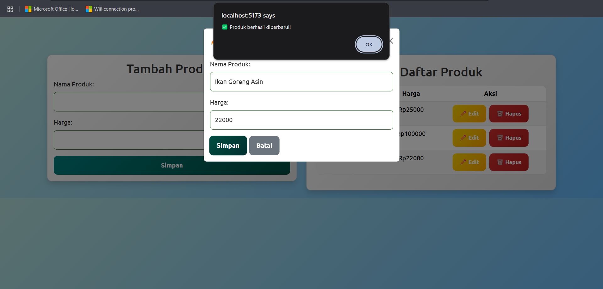

# TokoMapan - Sistem Manajemen Produk

## Nama Anggota 
- Irfan Zaki Riyanto (10231045) - Backend
- Maulana Malik Ibrahim (10231051) - Frontend

## Deskripsi Singkat
TokoMapan adalah aplikasi berbasis web yang dirancang untuk mempermudah pengelolaan produk dalam konteks e-commerce. Aplikasi ini dibangun menggunakan React.js untuk frontend dan Express.js sebagai backend. Dengan desain yang responsif dan estetis, aplikasi ini memastikan pengalaman pengguna yang optimal.

## Fitur
- Menambahkan produk baru
- Menampilkan daftar produk yang tersedia
- Mengedit informasi produk yang sudah ada
- Menghapus produk dengan mudah, namun tetap ada konfirmasi sebelum dihapus.

## Teknologi yang Digunakan
### Frontend: React.js, Bootstrap
- **React.js** digunakan untuk membuat tampilan yang interaktif dan cepat tanpa perlu refresh halaman.
- **Bootstrap** membantu dengan desain yang rapi dan responsif.

### Backend: Express.js, Node.js
- **Express.js** menangani API dan routing dengan sederhana.
- **Node.js** memastikan aplikasi berjalan cepat dan efisien.

### Database: PostgreSQL
- **PostgreSQL** digunakan untuk menyimpan data produk dengan aman dan dapat menangani banyak transaksi.

### HTTP Client: Axios
- **Axios** membantu menghubungkan frontend dan backend dengan mudah untuk mengambil atau mengirim data.

## Petunjuk Penggunaan

### Cara install dependensi
```bash
npm install
```
Perintah ini akan mengunduh dan memasang semua paket yang diperlukan agar aplikasi bisa berjalan.

### Cara menjalankan aplikasi backend
```bash
node index.js
```
Setelah menjalankan perintah di atas, maka server akan berjalan di `http://localhost:3001`

### Cara menjalankan aplikasi frontend
```bash
npm run dev
```
Setelah menjalankan perintah di atas, aplikasi dapat langsung dijalankan melalui `http://localhost:5173/`

## Daftar Endpoint API

### Root Endpoint
#### `GET /`

Digunakan untuk menampilkan pesan selamat datang dari server.

### Produk
#### `GET /produk`

Mengambil daftar semua produk.

#### `POST /produk`

Menambahkan produk baru.

#### `PUT /produk/:id`


Daftar produk setelah diupdate

Mengupdate informasi produk berdasarkan id.

#### `DELETE /produk/:id`


Daftar produk setelah dihapus

Menghapus produk berdasarkan id.

## Struktur Proyek
```
PROWEB
│── backend
│   │── node_modules/
│   │── db.js
│   │── index.js
│   │── package-lock.json
│   │── package.json
│
│── frontend
│   │── node_modules/
│   │── public/
│   │   ├── favicon.ico
│   │
│   │── src/
│   │   │── assets/
│   │   │   ├── react.svg
│   │   │
│   │   │── components/
│   │   │   ├── ProdukList.jsx
│   │   │   ├── TambahProduk.jsx
│   │   │
│   │   │── App.css
│   │   │── App.jsx
│   │   │── index.css
│   │   │── index.html
│   │   │── main.jsx
│   │
│   │── .gitignore
│   │── eslint.config.js
│   │── package-lock.json
│   │── package.json
│   │── README.md
│   │── vite.config.js
```

## Review Fitur

### Tampilan Web

Tampilan awal aplikasi

### Menambahkan Produk

Pengguna dapat menambahkan produk baru dengan mengisi informasi seperti nama dan harga. Setelah produk berhasil ditambahkan, sistem akan langsung memperbarui daftar produk tanpa perlu me-refresh halaman.

### Menampilkan Produk

Semua produk yang telah ditambahkan akan ditampilkan dalam bentuk tabel yang rapi dan mudah dibaca. Setiap produk ditampilkan dengan informasi lengkap, termasuk nama dan harga, sehingga memudahkan pengguna dalam melakukan pencarian.

### Mengedit Produk



Jika ada perubahan harga atau kesalahan dalam input data, pengguna dapat dengan mudah memperbarui informasi produk yang sudah ada. Setelah proses pengeditan selesai, perubahan akan langsung terlihat di daftar produk secara real-time.

### Menghapus Produk


Produk yang sudah tidak diperlukan dapat dihapus dengan satu klik. Sistem juga dapat menampilkan notifikasi konfirmasi sebelum penghapusan untuk menghindari kesalahan yang tidak disengaja.

## Debugging

Setelah melakukan berbagai operasi CRUD (Create, Read, Update, Delete) pada aplikasi e-commerce ini, terlihat bahwa tidak ada error yang muncul di console browser. Hal ini menunjukkan bahwa seluruh fitur berjalan dengan baik dan sesuai harapan. Implementasi CRUD dalam aplikasi ini sudah berjalan stabil dan responsif sesuai dengan fungsionalitas yang diharapkan.

## Error Handling


Ketika pengguna tidak mengisi kolom nama dan harga, maka akan muncul pop-up yang meminta pengguna untuk mengisi kolom tersebut.

## Troubleshooting
**Server tidak bisa berjalan:**
- Pastikan port `3001` tidak sedang digunakan oleh aplikasi lain.
- Cek apakah Node.js dan NPM sudah terinstal dengan benar.

**Frontend tidak dapat diakses:**
- Pastikan semua dependensi telah terpasang dengan menjalankan `npm install`.
- Periksa console browser untuk melihat adanya error yang muncul.

**API tidak memberikan respons:**
- Pastikan server backend sudah dalam kondisi berjalan.
- Periksa kembali URL dan port yang digunakan apakah sudah sesuai.

## Kesimpulan
Setelah dilakukan pengujian, aplikasi **TokoMapan** terbukti berjalan dengan baik tanpa adanya bug atau error. Aplikasi ini menggunakan **React.js** untuk frontend, **Express.js** sebagai backend, serta **PostgreSQL** untuk penyimpanan data, memastikan performa yang cepat dan efisien. Semua fitur **CRUD** dapat digunakan dengan lancar, memastikan pengalaman pengguna yang optimal. Desain antarmuka dibuat sederhana dan intuitif untuk mempermudah pengelolaan produk, dengan tampilan yang responsif berkat penggunaan **Bootstrap**. Selain itu, error handling diterapkan dengan baik untuk menangani berbagai kemungkinan kesalahan, seperti validasi input, sehingga web lebih stabil dan mudah untuk di-debug.

## Link Github
https://github.com/malikkzz/proweb.git